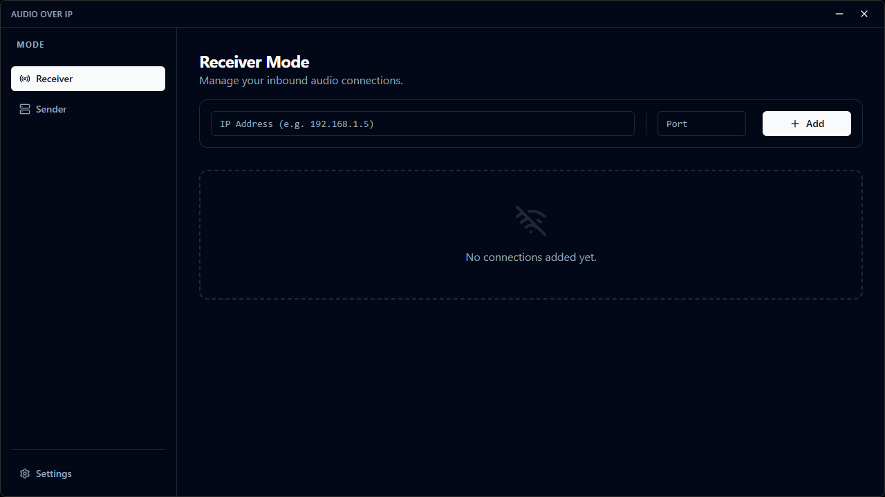
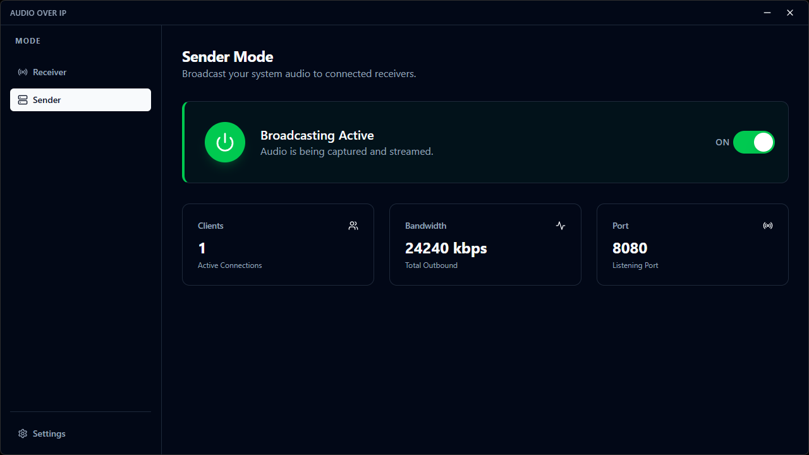
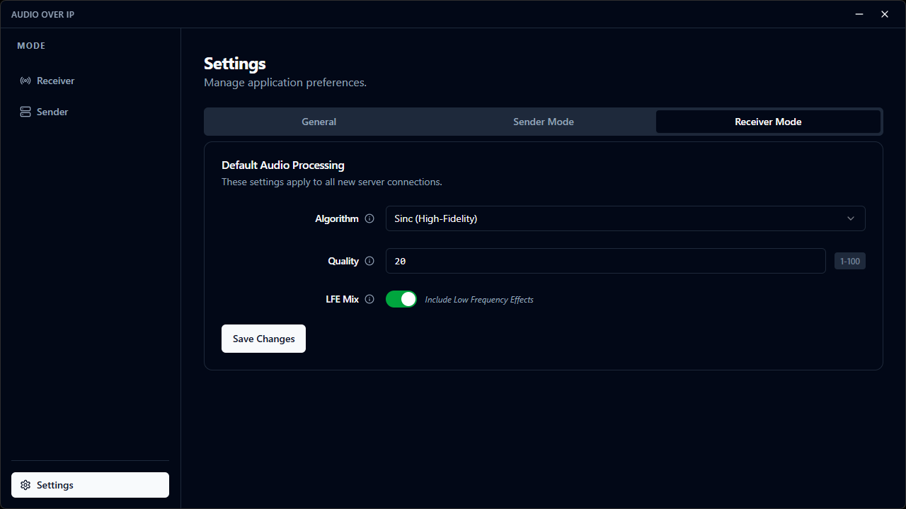
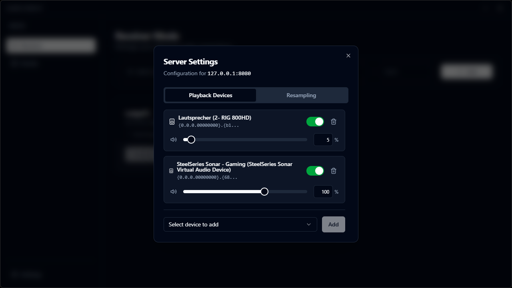

# Audio Over IP

Audio Over IP is a Windows application that allows you to stream raw[^1] system audio over the network with low latency.

## Features

- **Sender Mode (Server):** Broadcast your system's audio to multiple connected clients.
- **Receiver Mode (Client):** Connect to one or multiple senders and play the audio through one or multiple playback devices at once.
- **Audio Resampling:** Automatically handles sample rate conversion between different audio devices while offering multiple resampling algorithms to choose from.

## Important Considerations

### Security
The audio stream is **not** encrypted. Do not use this software for transmitting sensitive audio data on untrusted networks.

### Bandwidth

Raw system audio can generate very high bitrates, so your network must be able to stream large amounts of data reliably in real time.

**Example:**  
Audio device configuration (e.g. SteelSeries Sonar - Gaming):
- **Channels:** 8  
- **Bit depth:** 24‑bit  
- **Sample rate:** 96,000 Hz  

**Important note:**  
WASAPI always processes audio internally at **32‑bit**, so the actual captured format becomes:

- **Channels:** 8  
- **Bit depth:** 32‑bit  
- **Sample rate:** 96,000 Hz  

**Resulting Bandwidth Requirement:**  
With only **one client** connected, the server already needs to transmit **more than 24 Mbit/s**.


## Screenshots

<table>
  <tr>
    <td></td>
    <td></td>
  </tr>
  <tr>
    <td></td>
    <td></td>
  </tr>
</table>

## Installation (Using the prebuilt binaries)
1. Download the the latest release here: [Releases](https://github.com/deejayy/Audio-Over-IP/releases)
2. Unzip the exe file to any location and run it
3. Done. The app is a portable and self contained exe file with no installation required

## Manual Compilation & Development

### Prerequisites

Since this application relies on the Windows Core Audio API (WASAPI), it is currently **Windows-only**.

To build and run the project from source, you need:

- **Go** (version 1.25 or later)
- **Node.js** (version 22.21 or later + npm)
- **Wails CLI**: Install it with `go install github.com/wailsapp/wails/v2/cmd/wails@latest`
- **GCC Compiler**: Required for CGO (e.g., MinGW-w64)

### Compiling the code

1.  **Clone the repository:**
    ```bash
    git clone https://github.com/deejayy/Audio-Over-IP.git
    cd Audio-Over-IP
    ```

2.  **Check necessary wails dependencies:**
    ```bash
    # WebView2, Nodejs and npm need to appear with status "Installed"
    wails doctor
    ```

3.  **Run in Development Mode:**
    This will start the application with hot-reloading enabled for both backend and frontend.
    ```bash
    # The Wails CLI handles both Go and npm dependencies automatically
    wails dev
    ```

4.  **Build for Production:**
    To create a standalone `.exe` file:
    ```bash
    # The Wails CLI handles both Go and npm dependencies automatically
    wails build
    ```
    The output binary will be located in the `build/bin` directory.


## Tech Stack

- **Backend:** Go (Golang)
- **Frontend:** React, TypeScript, Vite
- **UI Framework:** Tailwind CSS, shadcn/ui, radix-ui
- **App Framework:** [Wails v2](https://wails.io/)
- **Audio API:** Windows Core Audio API
- **Networking:** Gorilla WebSocket

## License

This Project is licensed under the [EUPL License](LICENSE)

[^1]: "raw" as in 32-bit PCM (WAV formatted) Audio provided by the Windows Core Audio API